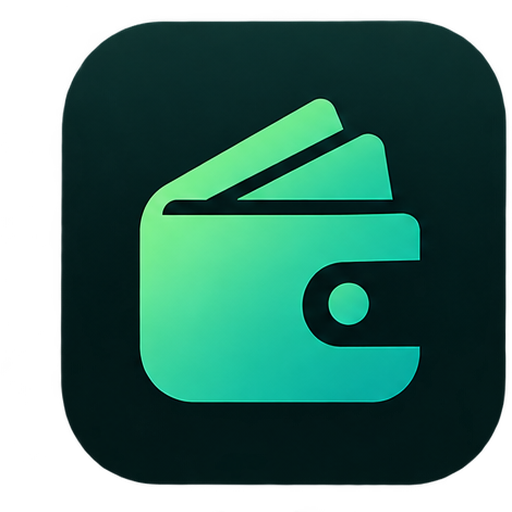

<div align="center">



# SpendWise

**Track. Analyze. Save.**

A beautiful, privacy-first desktop expense tracker for Windows. No account. No cloud. No subscriptions. Your financial data stays on your computer — always.

[](https://github.com/YOUR_USERNAME/spendwise/releases/latest)

[](https://github.com/YOUR_USERNAME/spendwise/releases)
[](https://github.com/YOUR_USERNAME/spendwise/releases)
[](./LICENSE)

[](https://react.dev/)
[](https://www.typescriptlang.org/)
[](https://www.electronjs.org/)
[](https://tailwindcss.com/)

</div>

---

## 📥 Download & Install

### Option 1: Installer (recommended)

1. Go to the [**Releases page**](https://github.com/YOUR_USERNAME/spendwise/releases/latest)
2. Download **`SpendWise Setup 1.0.0.exe`**
3. Run the installer — it will:
   - Install SpendWise to your `Programs` folder
   - Create a Start Menu shortcut
   - Create a Desktop shortcut (optional)
4. Launch **SpendWise** from the Start Menu or Desktop

### Option 2: Portable (no install)

1. Download **`SpendWise 1.0.0 portable.exe`** from the [Releases page](https://github.com/YOUR_USERNAME/spendwise/releases/latest)
2. Put it anywhere — Desktop, USB drive, external SSD
3. Double-click to run

> **⚠️ First-launch warning**
>
> Windows will show **"Windows protected your PC"** because the app isn't code-signed yet. This is normal for indie apps.
>
> **Click "More info" → "Run anyway"** — that's it, you're in.

### System Requirements

| | Minimum | Recommended |
|---|---|---|
| **OS** | Windows 10 (64-bit) | Windows 11 |
| **RAM** | 4 GB | 8 GB |
| **Disk space** | 250 MB | 500 MB |
| **Display** | 1024×600 | 1280×720 or higher |

**macOS and Linux builds** are planned — [watch the repo](https://github.com/YOUR_USERNAME/spendwise) to be notified.

---

## ✨ Features

### 📊 Dashboard at a glance
- **Total spent, this month, transactions** — the numbers you care about, up front
- **Interactive donut chart** — visual breakdown of spending by category
- **Category progress bars** — see where your money actually goes

### 💸 Effortless expense tracking
- **Add, edit, and delete** expenses in seconds
- **Custom categories** — add your own with a color picker
- **Search & filter** — find any expense instantly
- **Optional notes** — describe each entry

### 🌍 Multi-currency support
- **USD ($) and PKR (Rs.)** — switch on the fly
- **Locale-aware formatting** — `$1,234.56` vs `Rs. 1,235`
- **Saved preference** — remembers your choice forever

### 🔒 Privacy-first by design
- **100% offline** — works without internet, always
- **No accounts, no cloud, no tracking** — nothing leaves your computer
- **No telemetry** — we don't know who you are and we like it that way
- **Data lives on your PC** — in a standard folder you can back up

### 🎨 Thoughtful design
- **Green → teal gradient** brand identity
- **Native window chrome** — feels like a real desktop app, not a website wrapper
- **Keyboard-friendly** — every action reachable without a mouse
- **Subtle animations** — smooth, not flashy

---

## 📸 Screenshots

> _Add screenshots to `./docs/screenshots/` and update the paths below._

| Dashboard | Add Expense |
|---|---|
|  |  |

---

## 💾 Where Your Data Lives

Your expenses are saved **locally on your computer** — nowhere else.

| What | Where |
|---|---|
| **Your data** | `C:\Users\<YourName>\AppData\Roaming\SpendWise\` |
| **Logs** | Same folder, `logs\` subfolder |
| **Preferences** | Same folder, `Preferences` file |

### Backing up your data

Copy the entire `%APPDATA%\SpendWise\` folder to a USB drive or cloud backup. That's your full history.

**Quick access:** Open File Explorer and paste `%APPDATA%\SpendWise` into the address bar.

### Resetting the app

To wipe everything and start fresh:

1. Close SpendWise
2. Delete `%APPDATA%\SpendWise\`
3. Reopen SpendWise

> ⚠️ **Uninstalling the app does NOT delete your data.** This is intentional — if you reinstall later, your expenses come back. To fully remove SpendWise, uninstall it via **Settings → Apps**, then delete the `%APPDATA%\SpendWise\` folder.

---

## 🛠️ Tech Stack

Built with modern tools that keep the app small, fast, and easy to maintain.

| Layer | Choice |
|---|---|
| **UI** | [React 18](https://react.dev/) + [TypeScript](https://www.typescriptlang.org/) |
| **Build** | [Vite 6](https://vitejs.dev/) |
| **Styling** | [Tailwind CSS v4](https://tailwindcss.com/) |
| **State** | [Zustand](https://zustand-demo.pmnd.rs/) with localStorage persistence |
| **Charts** | [Recharts](https://recharts.org/) |
| **Icons** | [Lucide](https://lucide.dev/) |
| **Desktop** | [Electron 33](https://www.electronjs.org/) + [electron-builder](https://www.electron.build/) |

---

## 🧑‍💻 Building From Source

Want to build SpendWise yourself, contribute, or customize it? Here's everything you need.

### Prerequisites

- **Node.js** ≥ 18 (LTS 20 recommended)
- **npm** ≥ 9

### Setup

```bash
# Clone the repository
git clone https://github.com/YOUR_USERNAME/spendwise.git
cd spendwise

# Install dependencies
npm install
```

### Run in development

```bash
# Launches Vite dev server + Electron with hot reload
npm run electron:dev
```

The app window opens with DevTools attached. Save any React file and the UI updates instantly.

### Build the Windows app

```bash
# Produces both installer and portable .exe
npm run electron:build

# Or portable only (faster)
npm run electron:build:portable
```

Output lands in `./release/`:

- `SpendWise 1.0.0 x64.exe` — NSIS installer
- `SpendWise 1.0.0 portable.exe` — single-file exe

### Run the web version (for development)

```bash
npm run dev              # Vite dev server at http://localhost:5173
npm run build            # Production web build to ./dist
npm run preview          # Preview production build
```

The same codebase runs in both environments.

---

## 📁 Project Structure

```
spendwise/
├── electron/
│   ├── main.cjs                 # Electron main process
│   ├── preload.cjs              # Secure context bridge
│   └── icon.ico                 # Windows app icon (256×256)
│
├── public/
│   ├── favicon.png
│   ├── icon-192.png
│   ├── icon-512.png             # Also used as OG image
│   ├── logo.png
│   └── manifest.webmanifest
│
├── src/
│   ├── components/
│   │   ├── ui/
│   │   │   ├── Button.tsx
│   │   │   ├── Modal.tsx
│   │   │   └── EmptyState.tsx
│   │   ├── CategoryChart.tsx
│   │   ├── ExpenseForm.tsx
│   │   ├── ExpenseList.tsx
│   │   ├── Logo.tsx
│   │   ├── Navbar.tsx
│   │   └── SummaryCards.tsx
│   ├── constants/
│   │   └── categories.ts
│   ├── context/
│   │   └── CurrencyContext.tsx
│   ├── store/
│   │   └── useExpenseStore.ts
│   ├── types/
│   │   └── index.ts
│   ├── utils/
│   │   ├── asset.ts
│   │   ├── cn.ts
│   │   ├── currency.ts
│   │   └── format.ts
│   ├── App.tsx
│   ├── index.css
│   ├── main.tsx
│   └── vite-env.d.ts
│
├── index.html
├── package.json
├── tsconfig.json
├── tsconfig.app.json
├── tsconfig.node.json
├── vite.config.ts
├── LICENSE
└── README.md
```

---

## 🔧 Available Scripts

| Script | What it does |
|---|---|
| `npm run electron:dev` | Run the desktop app with hot reload |
| `npm run electron:build` | Package installer + portable `.exe` |
| `npm run electron:build:portable` | Package only the portable `.exe` |
| `npm run dev` | Web-only dev server (for UI work) |
| `npm run build` | Web-only production build |
| `npm run preview` | Preview web production build |
| `npm run lint` | Lint the codebase |

---

## 🗺️ Roadmap

Planned features, roughly in priority order:

- [ ] **Data export** — backup expenses to CSV / JSON from within the app
- [ ] **Recurring expenses** — auto-log rent, subscriptions, salary
- [ ] **Monthly budgets** — set limits per category, get warnings
- [ ] **6-month trends** — line chart of spending over time
- [ ] **Income tracking** — see balance = income − expenses
- [ ] **Auto-updates** — new versions install seamlessly
- [ ] **macOS build** — native `.dmg`
- [ ] **Linux build** — `.AppImage` and `.deb`
- [ ] **Dark mode** — toggle with persisted preference

Have a feature request? [Open an issue](https://github.com/YOUR_USERNAME/spendwise/issues/new) — I read every one.

---

## 🤝 Contributing

Found a bug? Have an idea? PRs and issues are welcome.

### Reporting bugs

[Open an issue](https://github.com/YOUR_USERNAME/spendwise/issues/new) with:

- **What you did** — steps to reproduce
- **What you expected** vs **what happened**
- **Screenshots or a screen recording** if relevant
- **Your Windows version** and app version (found in `Help → About`)

### Contributing code

1. **Fork** the repo
2. **Create a branch** — `git checkout -b feature/amazing-feature`
3. **Commit** — `git commit -m 'Add amazing feature'`
4. **Push** — `git push origin feature/amazing-feature`
5. **Open a Pull Request**

Please run `npm run lint` and `npm run build` before submitting.

---

## 🐛 Known Issues

| Issue | Workaround |
|---|---|
| Windows SmartScreen warning on first launch | Click **More info → Run anyway**. Removed by code signing (planned). |
| App fails to launch after update | Delete `%APPDATA%\SpendWise\Cache` and restart |
| Antivirus flags the `.exe` | Add SpendWise to your AV exclusions. Common for unsigned indie apps. |

---

## ❓ FAQ

**Is my data safe?**
Yes. Everything is stored locally on your computer. The app never sends data anywhere — no analytics, no telemetry, no cloud sync.

**Do I need internet?**
No. SpendWise works completely offline.

**Can I sync between computers?**
Not yet. You can manually copy the `%APPDATA%\SpendWise\` folder between machines.

**Is there a mobile version?**
Not yet. Web access is possible by building from source.

**How do I uninstall it?**
Windows Settings → Apps → SpendWise → Uninstall. Then delete `%APPDATA%\SpendWise\` to remove your data too.

**Why is the download ~85 MB?**
Electron bundles Chromium and Node.js so the app runs natively. It's the trade-off for using web tech to build a real desktop app.

**Can I contribute?**
Absolutely — [open an issue](https://github.com/YOUR_USERNAME/spendwise/issues) or submit a PR.

---

## 📄 License

Distributed under the **MIT License**. See [`LICENSE`](./LICENSE) for the full text.

You're free to use, modify, and distribute this software — commercially or personally.

---

## 🙏 Acknowledgements

- [Electron](https://www.electronjs.org/) — for making desktop apps in web tech possible
- [React](https://react.dev/) — for the component model that keeps this clean
- [Tailwind CSS](https://tailwindcss.com/) — for making the UI delightful to build
- [Recharts](https://recharts.org/) — for beautiful charts with almost no effort
- [Lucide](https://lucide.dev/) — for the gorgeous icon set
- [Zustand](https://zustand-demo.pmnd.rs/) — for proving state management can be simple
- [Vite](https://vitejs.dev/) — for the fastest build tooling in the ecosystem

---

## 📬 Contact

**Your Name** — [@your_twitter](https://twitter.com/your_twitter)

Project Link: [https://github.com/YOUR_USERNAME/spendwise](https://github.com/YOUR_USERNAME/spendwise)

Found a bug? [Open an issue](https://github.com/YOUR_USERNAME/spendwise/issues/new)

---

<div align="center">

**If SpendWise helps you track your spending, please give it a ⭐**

Made with 💚 and [Electron](https://www.electronjs.org/)

</div>
